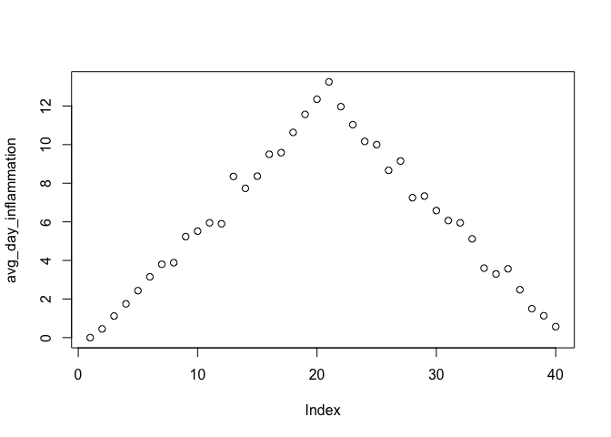
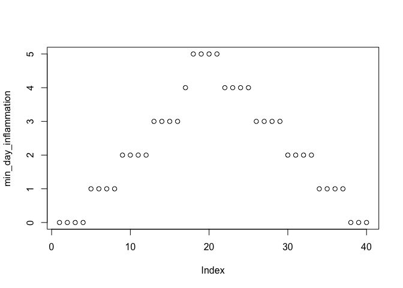
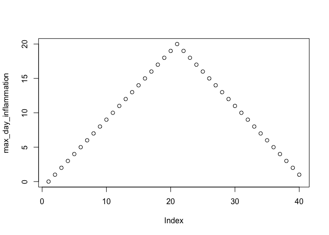
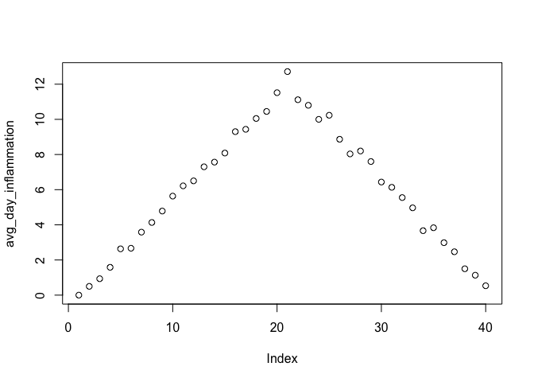
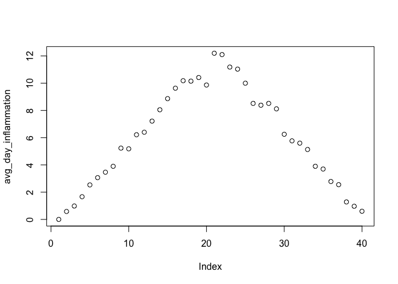
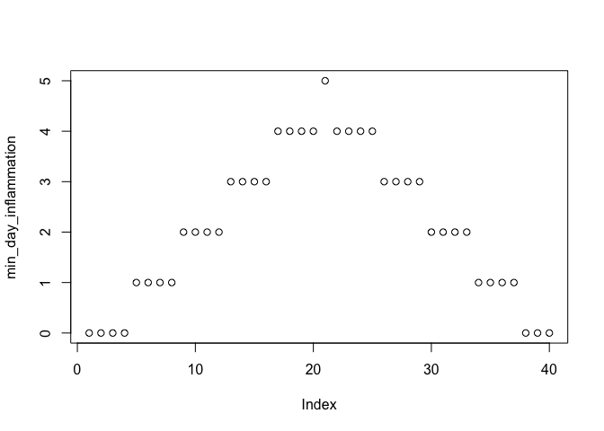

Let’s make it functional part 1: R series
================

**2ndMeeting - Saturday, November 23, 2019**

**Tutors and Organizers:** - Pande Putu Erawijantati - Felix Salim - Mia
Fitria Utami

## Content:

  - Data types and structure (review)
      - Loop
      - Functions
      - Analysing multiple datasets Sources:
  - Composing function
    <http://swcarpentry.github.io/r-novice-inflammation/02-func-R/index.html>
  - Application
    <http://swcarpentry.github.io/r-novice-inflammation/03-loops-R/index.html>
  - Problem set: TBA

\*Notes: the notes was created in Python 3 kernel with extension for
runing R code because some of the participants already familiar with
Python.

### Data types and structure

R contains 6 data types and structures, which are: \* character \*
numeric (real or decimal) \* integer \* logical \* complex

Please read and try the example here:
<https://swcarpentry.github.io/r-novice-inflammation/13-supp-data-structures/>

### Functions

ref:
<http://swcarpentry.github.io/r-novice-inflammation/02-func-R/index.html>

Functions is a defined sections of program that perform a specific task.
Defining a functions is very usefull if you are going to perform similar
task for several times. For example, you have several data that you will
visualize as a barplot, then it is better to create a defined function
to plot a barplot. In the example of [Creating
functions](http://swcarpentry.github.io/r-novice-inflammation/02-func-R/index.html).
Below is the example to convert Fahrenheit into Celsius.

Defining the function. Pay attention to the syntax of defining the
functions in R and Python below.

**R**

``` r
fahrenheit_to_celsius <- function(temp_F) {
  temp_C <- (temp_F - 32) * 5 / 9
  return(temp_C)
}
fahrenheit_to_celsius(100)
```

    ## [1] 37.77778

**Python**

``` python
import numpy as np
def fahrenheit_to_celcius(temp_F):
  temp_C = ((np.float(temp_F)-32)*5/9)
  return(temp_C)
fahrenheit_to_celcius(100)
```

    ## 37.77777777777778

Now, let’s try our functions understanding in analysing multiple set of
data. We will use the same set of data that we use in the [fist
meeting](http://swcarpentry.github.io/r-novice-inflammation/data/r-novice-inflammation-data.zip)
Previously, we only try to analyze the `inflammation-01.csv`. We still
have 12 data to go. Let’s try to apply functions to analyse our
inflammation data. Step by step tutorial will be following the example
in
<http://swcarpentry.github.io/r-novice-inflammation/03-loops-R/index.html>
First please make sure your are working in the right directory as we
studied in the previous meeting. Next, Let’s create a function called
analyze that creates graphs of the minimum, average, and maximum daily
inflammation rates for a single data set. Apply that function to the
`inflammation-01.csv`

``` r
analyze <- function(filename) {
  # Plots the average, min, and max inflammation over time.
  # Input is character string of a csv file.
  dat <- read.csv(file = filename, header = FALSE)
  avg_day_inflammation <- apply(dat, 2, mean)
  plot(avg_day_inflammation)
  max_day_inflammation <- apply(dat, 2, max)
  plot(max_day_inflammation)
  min_day_inflammation <- apply(dat, 2, min)
  plot(min_day_inflammation)
}
#call function
analyze("data/inflammation-01.csv")
```

<!-- --><!-- --><!-- -->
What about using the same function to analyse the second
dataset?

``` r
analyze("data/inflammation-02.csv")
```

<!-- --><!-- --><!-- -->
One line do the magic thing right? Hmmm, but this is not the easier way
to do that. Let’s do some magic `Loops` to replicate the same action of
one function to all of 12 data that we have.

## For Loops

To replicate same thing for several times, we can use `For Loops`.
Suppose we want to print each word in a sentence. One way is to use six
print statements:

**Bad example first**

``` r
best_practice <- c("Let", "the", "computer", "do", "the", "work")
print_words <- function(sentence) {
  print(sentence[1])
  print(sentence[2])
  print(sentence[3])
  print(sentence[4])
  print(sentence[5])
  print(sentence[6])
}

print_words(best_practice)
```

    ## [1] "Let"
    ## [1] "the"
    ## [1] "computer"
    ## [1] "do"
    ## [1] "the"
    ## [1] "work"

Seems works, what’s wrong? Try this

``` r
print_words(best_practice[-6])
```

    ## [1] "Let"
    ## [1] "the"
    ## [1] "computer"
    ## [1] "do"
    ## [1] "the"
    ## [1] NA

R seems nice because it dose not throw an error, in python, this is a
big NO. Example in
python.

``` python
best_practice=["Let", "the", "computer", "do", "the", "work"] #this is call `list` in python, we will talk about this later.
def print_words(sentence):
  print(sentence[0]) #remember python start with 0 but R start with 1
  print(sentence[1])
  print(sentence[2])
  print(sentence[3])
  print(sentence[4])
  print(sentence[5])

print_words(best_practice)
```

    ## Let
    ## the
    ## computer
    ## do
    ## the
    ## work

``` python
print_words(best_practice[-6])
```

    ## Error in py_call_impl(callable, dots$args, dots$keywords): IndexError: string index out of range
    ## 
    ## Detailed traceback: 
    ##   File "<string>", line 1, in <module>
    ##   File "<string>", line 5, in print_words

Now, let’s try using `For loops` instead and see how it works.

``` r
print_words <- function(sentence) {
  for (word in sentence) {
    print(word)
  }
}

print_words(best_practice)
```

    ## [1] "Let"
    ## [1] "the"
    ## [1] "computer"
    ## [1] "do"
    ## [1] "the"
    ## [1] "work"

Please try anothe example in
<http://swcarpentry.github.io/r-novice-inflammation/03-loops-R/index.html>
before we are going to process our multiple files.

## Processing Multiple Files

Sometimes we do not need to create function for specific task if it is
available in the programing languange. For example, to begin the
analysis on multiple files, we have to list what files we are going to
analyze. We do not need to write it ourselves because R already has a
function to do this called `list.files.` If we run the function without
any arguments, `list.files()`, it returns every file in the current
working directory. We can understand this result by reading the help
file `(?list.files)`. The first argument, path, is the path to the
directory to be searched, and it has the default value of `"."` (“.” is
shorthand for the current working directory). The second argument,
pattern, is the pattern being searched, and it has the default value of
NULL. Since no pattern is specified to filter the files, all files are
returned.

``` r
list.files(path = "data", pattern = "csv")
```

    ##  [1] "car-speeds-cleaned.csv" "car-speeds.csv"        
    ##  [3] "inflammation-01.csv"    "inflammation-02.csv"   
    ##  [5] "inflammation-03.csv"    "inflammation-04.csv"   
    ##  [7] "inflammation-05.csv"    "inflammation-06.csv"   
    ##  [9] "inflammation-07.csv"    "inflammation-08.csv"   
    ## [11] "inflammation-09.csv"    "inflammation-10.csv"   
    ## [13] "inflammation-11.csv"    "inflammation-12.csv"   
    ## [15] "sample.csv"             "small-01.csv"          
    ## [17] "small-02.csv"           "small-03.csv"

``` r
list.files(path = "data", pattern = "inflammation")
```

    ##  [1] "inflammation-01.csv" "inflammation-02.csv" "inflammation-03.csv"
    ##  [4] "inflammation-04.csv" "inflammation-05.csv" "inflammation-06.csv"
    ##  [7] "inflammation-07.csv" "inflammation-08.csv" "inflammation-09.csv"
    ## [10] "inflammation-10.csv" "inflammation-11.csv" "inflammation-12.csv"

> Remember that, if you will be working with larger project, it is
> better to specified sub-directories for better organizations. Refer to
> [A quick guide to organizing computational biology
> projects](http://swcarpentry.github.io/r-novice-inflammation/03-loops-R/index.html)
> for more advice.

To show the complete path in directory you can use the argument
`full.names = TRUE`

``` r
list.files(path = "data", pattern = "csv", full.names = TRUE)
```

    ##  [1] "data/car-speeds-cleaned.csv" "data/car-speeds.csv"        
    ##  [3] "data/inflammation-01.csv"    "data/inflammation-02.csv"   
    ##  [5] "data/inflammation-03.csv"    "data/inflammation-04.csv"   
    ##  [7] "data/inflammation-05.csv"    "data/inflammation-06.csv"   
    ##  [9] "data/inflammation-07.csv"    "data/inflammation-08.csv"   
    ## [11] "data/inflammation-09.csv"    "data/inflammation-10.csv"   
    ## [13] "data/inflammation-11.csv"    "data/inflammation-12.csv"   
    ## [15] "data/sample.csv"             "data/small-01.csv"          
    ## [17] "data/small-02.csv"           "data/small-03.csv"

Let’s test out running our analyze function by using it on the first
three files in the vector returned by `list.files`:

``` r
filenames <- list.files(path = "data",  
                        # Now follows a regular expression that matches:
                        pattern = "inflammation-[0-9]{2}.csv",
                        #          |            |        the standard file extension of comma-separated values
                        #          |            the variable parts (two digits, each between 0 and 9)
                        #          the static part of the filenames
                        full.names = TRUE)
filenames <- filenames[1:3]
for (f in filenames) {
  print(f)
  analyze(f)
}
```

    ## [1] "data/inflammation-01.csv"

<!-- --><!-- --><!-- -->

    ## [1] "data/inflammation-02.csv"

<!-- --><!-- --><!-- -->

    ## [1] "data/inflammation-03.csv"

<!-- --><!-- --><!-- -->
\> In this lesson we saw how to use a simple for loop to repeat an
operation. As you progress with R, you will learn that there are
multiple ways to accomplish this. Sometimes the choice of one method
over another is more a matter of personal style, but other times it can
have consequences for the speed of your code. For instruction on best
practices, see this [software carpentry supplementary
lesson](http://swcarpentry.github.io/r-novice-inflammation/15-supp-loops-in-depth/)
that demonstrates how to properly repeat operations in R.

## More challenge

See notebooks here, it also cover our next meeting topics.
<https://www.kaggle.com/rtatman/getting-started-in-r-load-data-into-r>
