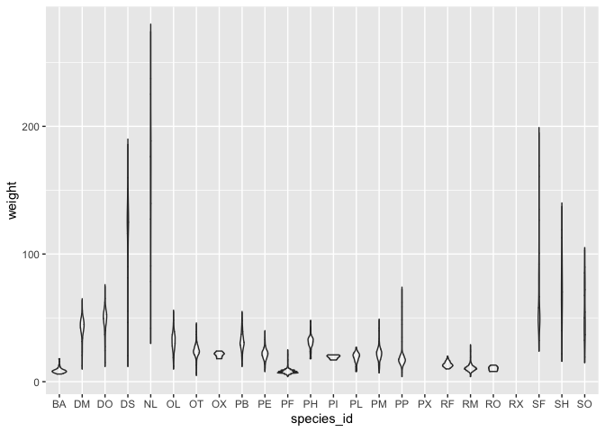
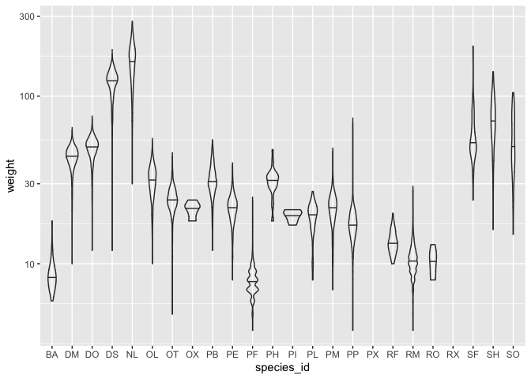
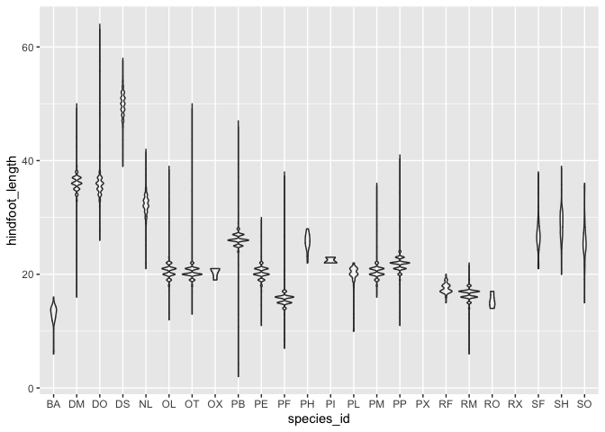
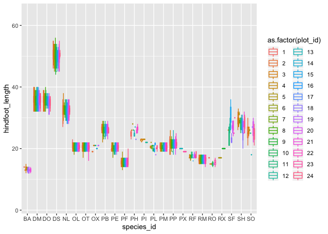
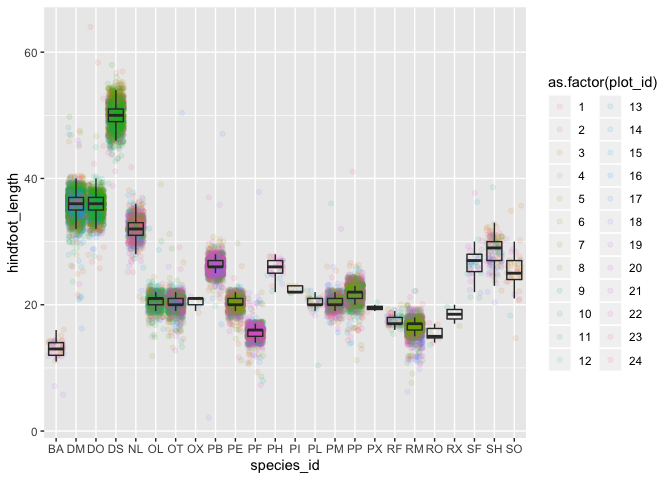
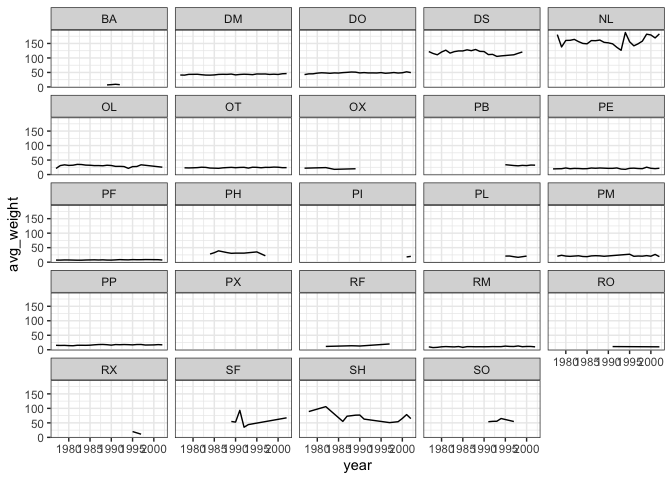

Answer for challenge in Data is beautiful part 1 - Hello Tidyverse\! : R
Seriesr
================

## Data Preparation

``` r
library(tidyverse)
```

    ## ── Attaching packages ───────────────────────────────────────────────────────────────────────────────────────── tidyverse 1.3.0 ──

    ## ✓ ggplot2 3.2.1     ✓ purrr   0.3.3
    ## ✓ tibble  2.1.3     ✓ dplyr   0.8.3
    ## ✓ tidyr   1.0.0     ✓ stringr 1.4.0
    ## ✓ readr   1.3.1     ✓ forcats 0.4.0

    ## ── Conflicts ──────────────────────────────────────────────────────────────────────────────────────────── tidyverse_conflicts() ──
    ## x dplyr::filter() masks stats::filter()
    ## x dplyr::lag()    masks stats::lag()

``` r
surveys <- read_csv("data_raw/portal_data_joined.csv")
```

    ## Parsed with column specification:
    ## cols(
    ##   record_id = col_double(),
    ##   month = col_double(),
    ##   day = col_double(),
    ##   year = col_double(),
    ##   plot_id = col_double(),
    ##   species_id = col_character(),
    ##   sex = col_character(),
    ##   hindfoot_length = col_double(),
    ##   weight = col_double(),
    ##   genus = col_character(),
    ##   species = col_character(),
    ##   taxa = col_character(),
    ##   plot_type = col_character()
    ## )

``` r
surveys_complete <- surveys %>%
  filter(!is.na(weight),           # remove missing weight
         !is.na(hindfoot_length),  # remove missing hindfoot_length
         !is.na(sex))                # remove missing sex
```

## Challenge 1

> To see the shape of distributions, replace the boxplot with a violin
> plot; see
`geom_violin()`.

``` r
ggplot(data = surveys_complete, mapping = aes(x = species_id, y = weight)) +
  geom_violin(alpha = 0)
```

<!-- -->

> 2.  Sometimes, we need to change the scale for easier observations.
>     Try to represent the weight on the log10 scale; see
>     `scale_y_log10()`.

``` r
ggplot(data = surveys_complete, mapping = aes(x = species_id, y =weight)) +
  geom_violin(alpha = 0,  draw_quantiles=0.5) + #draw quantiles to see the median
  scale_y_log10()
```

    ## Warning in regularize.values(x, y, ties, missing(ties)): collapsing to unique
    ## 'x' values
    
    ## Warning in regularize.values(x, y, ties, missing(ties)): collapsing to unique
    ## 'x' values

<!-- -->

> 3.  Create a boxplot for `hindfoot_length` and overlay the boxplot
>     with jitter for actual
measurements

``` r
ggplot(data = surveys_complete, mapping = aes(x = species_id, y =hindfoot_length)) +
  geom_violin(alpha = 0)
```

<!-- -->

> 4.  Add color for each data point based on which plot the sample was
>     taken
(`plot_id`)

``` r
ggplot(data = surveys_complete, mapping = aes(x = species_id, y =hindfoot_length, color=as.factor(plot_id))) +
  geom_boxplot(alpha = 0)
```

<!-- -->

Let’s put the color as a jitter
instead.

``` r
ggplot(data = surveys_complete, mapping = aes(x = species_id, y = hindfoot_length)) +
  geom_jitter(alpha = 0.1, aes(color = as.factor(plot_id))) +
  geom_boxplot(alpha = 0)
```

<!-- -->

## Challenge 2

> Use what you just learned to create a plot that depicts how the
> average weight of each species changes through the years.

``` r
yearly_weight <- surveys_complete %>%
                group_by(year, species_id) %>%
                 summarize(avg_weight = mean(weight))
ggplot(data = yearly_weight, mapping = aes(x=year, y=avg_weight)) +
   geom_line() +
   facet_wrap(vars(species_id)) +
   theme_bw()
```

    ## geom_path: Each group consists of only one observation. Do you need to adjust
    ## the group aesthetic?

<!-- -->
