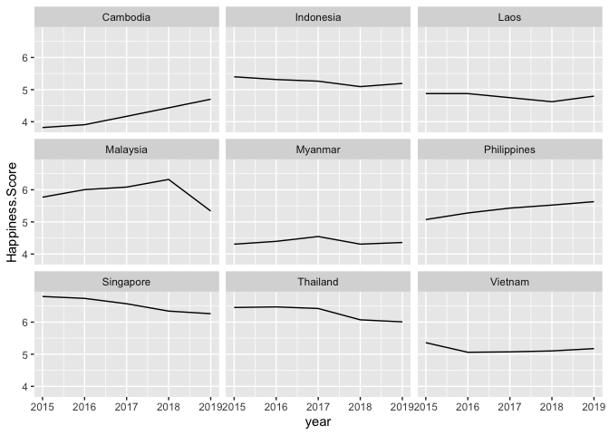
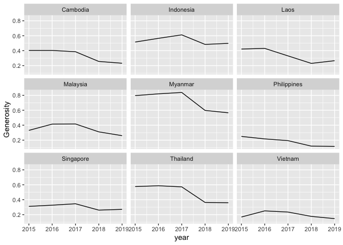

6thSemiHackathon\_Session\_Era
================

## Datasets

I will explore the trend from the world happiness datasets (2015-2019)
specifically for Indonesia and compared it to the all region in South
East Asia.

**Data preparation**

1.  Prepare the directory

<!-- end list -->

``` r
dir.create("data_raw")
```

    ## Warning in dir.create("data_raw"): 'data_raw' already exists

2.  Download data from [kaggle-world happinness
    datasets](https://www.kaggle.com/unsdsn/world-happiness).

\#example: (Notes: better download
    directly)

    download.file(url="https://www.kaggle.com/unsdsn/world-happiness/download/pNRoj8OUY1j8qhSQbRnv%2Fversions%2FO5X6zWeGu2XCpwGL2QkE%2Ffiles%2F2015.csv?datasetVersionNumber=2",
                  destfile = "data_raw/2015.csv")

3.  Load all
    data

<!-- end list -->

``` r
library(tidyverse)
```

    ## ── Attaching packages ──────────────────────────────────────────────────────────────────────── tidyverse 1.3.0 ──

    ## ✓ ggplot2 3.2.1     ✓ purrr   0.3.3
    ## ✓ tibble  2.1.3     ✓ dplyr   0.8.4
    ## ✓ tidyr   1.0.2     ✓ stringr 1.4.0
    ## ✓ readr   1.3.1     ✓ forcats 0.4.0

    ## ── Conflicts ─────────────────────────────────────────────────────────────────────────── tidyverse_conflicts() ──
    ## x dplyr::filter() masks stats::filter()
    ## x dplyr::lag()    masks stats::lag()

``` r
data_2015 = read_csv("data_raw/2015.csv")
```

    ## Parsed with column specification:
    ## cols(
    ##   Country = col_character(),
    ##   Region = col_character(),
    ##   `Happiness Rank` = col_double(),
    ##   `Happiness Score` = col_double(),
    ##   `Standard Error` = col_double(),
    ##   `Economy (GDP per Capita)` = col_double(),
    ##   Family = col_double(),
    ##   `Health (Life Expectancy)` = col_double(),
    ##   Freedom = col_double(),
    ##   `Trust (Government Corruption)` = col_double(),
    ##   Generosity = col_double(),
    ##   `Dystopia Residual` = col_double()
    ## )

``` r
data_2016 = read_csv("data_raw/2016.csv")
```

    ## Parsed with column specification:
    ## cols(
    ##   Country = col_character(),
    ##   Region = col_character(),
    ##   `Happiness Rank` = col_double(),
    ##   `Happiness Score` = col_double(),
    ##   `Lower Confidence Interval` = col_double(),
    ##   `Upper Confidence Interval` = col_double(),
    ##   `Economy (GDP per Capita)` = col_double(),
    ##   Family = col_double(),
    ##   `Health (Life Expectancy)` = col_double(),
    ##   Freedom = col_double(),
    ##   `Trust (Government Corruption)` = col_double(),
    ##   Generosity = col_double(),
    ##   `Dystopia Residual` = col_double()
    ## )

``` r
data_2017 = read_csv("data_raw/2017.csv")
```

    ## Parsed with column specification:
    ## cols(
    ##   Country = col_character(),
    ##   Happiness.Rank = col_double(),
    ##   Happiness.Score = col_double(),
    ##   Whisker.high = col_double(),
    ##   Whisker.low = col_double(),
    ##   Economy..GDP.per.Capita. = col_double(),
    ##   Family = col_double(),
    ##   Health..Life.Expectancy. = col_double(),
    ##   Freedom = col_double(),
    ##   Generosity = col_double(),
    ##   Trust..Government.Corruption. = col_double(),
    ##   Dystopia.Residual = col_double()
    ## )

``` r
data_2018 = read_csv("data_raw/2018.csv")
```

    ## Parsed with column specification:
    ## cols(
    ##   `Overall rank` = col_double(),
    ##   `Country or region` = col_character(),
    ##   Score = col_double(),
    ##   `GDP per capita` = col_double(),
    ##   `Social support` = col_double(),
    ##   `Healthy life expectancy` = col_double(),
    ##   `Freedom to make life choices` = col_double(),
    ##   Generosity = col_double(),
    ##   `Perceptions of corruption` = col_character()
    ## )

``` r
data_2019 = read_csv("data_raw/2019.csv")
```

    ## Parsed with column specification:
    ## cols(
    ##   `Overall rank` = col_double(),
    ##   `Country or region` = col_character(),
    ##   Score = col_double(),
    ##   `GDP per capita` = col_double(),
    ##   `Social support` = col_double(),
    ##   `Healthy life expectancy` = col_double(),
    ##   `Freedom to make life choices` = col_double(),
    ##   Generosity = col_double(),
    ##   `Perceptions of corruption` = col_double()
    ## )

4.  Extract only Southeastern asia, modify columns name

<!-- end list -->

``` r
#Filter if region is Southeastern Asia
data_2015_AS <-data_2015 %>% 
    filter(Region=="Southeastern Asia") %>% 
    mutate(year=2015) %>% 
  rename_all(gsub, pattern = '[ ()]', replacement = '.') %>% 
  rename( GDP.per.Capita= Economy..GDP.per.Capita.) %>% 
  rename( Life.Expectancy= Health..Life.Expectancy.) %>% 
  rename( GDP.per.capita= GDP.per.Capita) %>% 
  rename(Perceptions.of.corruption = Trust..Government.Corruption.)

data_2016_AS <-data_2016 %>% 
  filter(Region=="Southeastern Asia") %>% 
  mutate(year=2016) %>% 
  rename_all(gsub, pattern = '[ ()]', replacement = '.') %>% 
  rename( GDP.per.Capita= Economy..GDP.per.Capita.) %>% 
  rename( Life.Expectancy= Health..Life.Expectancy.) %>% 
  rename( GDP.per.capita= GDP.per.Capita) %>% 
  rename(Perceptions.of.corruption = Trust..Government.Corruption.)

row_reg <- data_2015_AS$Country
```

``` r
#add the region information to the 2017,2018,2019

data_2017_AS <-data_2017 %>% filter(Country %in% row_reg) %>% 
  mutate(year=2017,Region="Southeastern Asia") %>% 
  rename_all(gsub, pattern = '[ ()]', replacement = '.') %>% 
  rename( GDP.per.Capita= Economy..GDP.per.Capita.) %>% 
  rename( Life.Expectancy= Health..Life.Expectancy.) %>% 
  rename( GDP.per.capita= GDP.per.Capita) %>% 
  rename(Perceptions.of.corruption = Trust..Government.Corruption.)
  
data_2018_AS <-data_2018 %>% filter(`Country or region` %in% row_reg) %>% 
  mutate(year=2018,Region="Southeastern Asia") %>% 
  rename(Country = `Country or region`) %>% 
  rename_all(gsub, pattern = '[ ()]', replacement = '.') %>% 
  rename( Life.Expectancy= Healthy.life.expectancy) %>% 
  rename(Happiness.Score = Score) %>% 
  rename(Freedom = Freedom.to.make.life.choices)
  

data_2019_AS <-data_2019 %>% filter(`Country or region` %in% row_reg) %>% 
  mutate(year=2019,Region="Southeastern Asia") %>% 
  rename(Country = `Country or region`) %>% 
  rename_all(gsub, pattern = '[ ()]', replacement = '.') %>% 
  rename( Life.Expectancy= Healthy.life.expectancy) %>% 
  rename(Happiness.Score = Score) %>% 
  rename(Freedom = Freedom.to.make.life.choices)
```

5.  Find intesect of dataframe rows

<!-- end list -->

``` r
#intersect
common <- reduce(list(colnames(data_2015_AS), colnames(data_2016_AS), colnames(data_2017_AS),colnames(data_2018_AS), colnames(data_2019_AS)), intersect)
```

6.  Combine tables (naive ways)

<!-- end list -->

``` r
#select similar columns
dt_2015_AS <- data_2015_AS %>% select(one_of(common))
dt_2016_AS <- data_2016_AS %>% select(one_of(common))
dt_2017_AS <- data_2017_AS %>% select(one_of(common))
dt_2018_AS <- data_2018_AS %>% select(one_of(common)) %>% mutate(Perceptions.of.corruption = as.double(Perceptions.of.corruption))
dt_2019_AS <- data_2019_AS %>% select(one_of(common))

#combine
df_AS <- reduce(list(dt_2015_AS,dt_2016_AS,dt_2017_AS,dt_2018_AS,dt_2019_AS), bind_rows)
```

7.  Plot trend from the data

<!-- end list -->

1.  Happiness Score

<!-- end list -->

``` r
ggplot(data = df_AS, mapping = aes(x = year, y = Happiness.Score)) +
  geom_line() +
facet_wrap(facets = vars(Country))
```

<!-- -->

2.  Generous

<!-- end list -->

``` r
ggplot(data = df_AS, mapping = aes(x = year, y = Generosity)) +
  geom_line() +
facet_wrap(facets = vars(Country))
```

<!-- -->

What kind analysis we can go from here?
